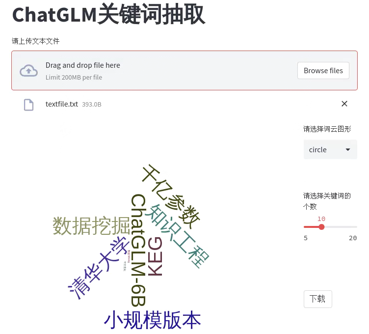

# ChatGLM-Keyword

🤖️ 一个使用ChatGLM抽取上传文本关键词和词频，并绘制词云图的项目，目标是帮助用户分析文本和核心内容。

💡 感谢Datawhale社区提供锻炼与展示的平台，感谢[langchain-ChatGLM](https://github.com/imClumsyPanda/langchain-ChatGLM) [ChatLLM](https://github.com/yuanjie-ai/ChatLLM) 的无私分享。

## 1. 项目预期目标

- **第一阶段**：用户输入文本或直接上传文章，抽取出相应关键词并统计关键词的出现频率，依据词频结合Echarts进行词云图的绘制，并在前端页面呈现出来。

- **第二阶段**：在第一阶段的基础上结合Echarts继续丰富项目的可视化功能。剩下的可增加的功能有两个思路：
  
  - 尝试对用户上传的JSON或CSV文件进行多维度分析。
  
  - 结合音频信号处理相关领域的知识，尝试对用户上传的视频文件进行分析。

## 2. 项目实现基本功能（截至2023/06/06）

- 用户在上传需要进行分析的文本或文章时，可以自定义统计关键词的数量。

- 项目能够对用户上传的文本或文章进行关键词的抽取操作，并统计关键词的词频在前端界面呈现给用户。

- 项目采用Echarts技术对抽取出的关键词进行词云图的绘制，并展现在前端界面。

- 用户可以在前端界面手动对词云图效果进行更换。

### 3. 项目已经解决的问题（截至2023/06/06）

- 增加模型缓存，解决每次上传文件重新加载模型问题

### 4. 系统安装说明

#### 下载项目
```Shell
git clone https://github.com/freeline55/ChatGLM-Keyword.git
```

#### 安装依赖
```Shell
pip install -r requirements.txt
```

#### 启动项目
```Shell
python -m streamlit run main.py
```
项目启动后会自动加载ChatGLM模型,如果本地没有缓存会联网下载,时间较长请耐心等待

项目默认地址为: http://localhost:8501 , 使用浏览器打开即可

#### 测试项目
目前项目仅支持上传文本文件,且支持的文本长度有限,项目在 **content** 目录下内置了3个测试文档,供上传测试使用

点击上传按钮,后台会自动解析上传的文本并生成词云图,在页面下方进行展示


## 5. 项目呈现效果（截至2023/06/06）



## 6. 项目贡献名单

| 贡献者   | 贡献内容 |
| ----- | ---- |
| 星辰 | 队长，负责技术路线确定、队员任务分工、整体进度把握等 |
| 沉淀 | 应用方向调研与gpt能力测试、ChatGLM部署与应用开发等 |
| 何材 | streamlit前端技术研发，pyecharts词云图页面设计等 |
| 小陈 | 跟踪并汇总往期优秀项目，部署与应用ChatGLM等 |
| 小杨 | 跟踪并汇总往期优秀项目，实现词云图显示效果等 |
| Betterme | 参与项目讨论，提供解决思路，分享研究心得等 |
| 小萝卜 | 参与项目讨论，研究抽取关键词的prompt等 |


